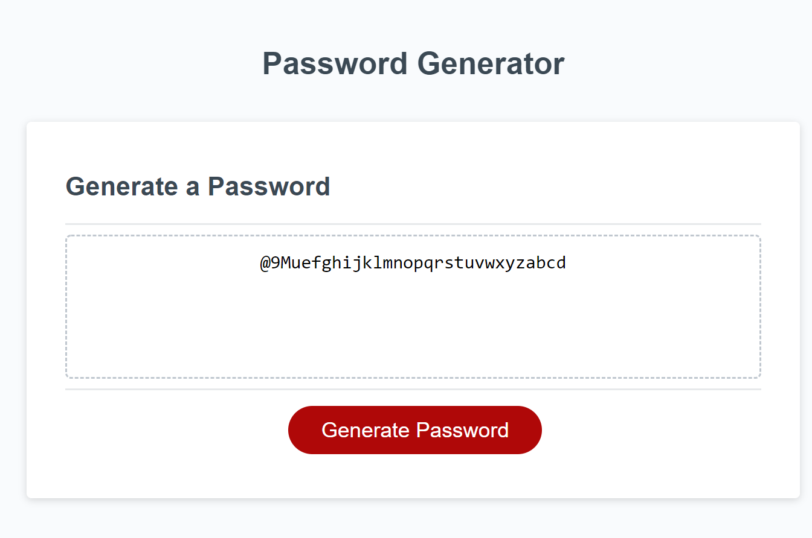

# Kiwi-password-generator

## Objective

Create an app that generates a secure password based on user input

User input includes:

- password length from 8 to 128 characters
- upper case characters
- lower case characters
- arabic numerals
- special characters

---

## Link to site

- https://srgiovanni.github.io/Kiwi-password-generator/

## Screenshot

## Future development tasks

- Change to Window.crypto for random variables
- Use onscreen form instead of prompts to select character classes
